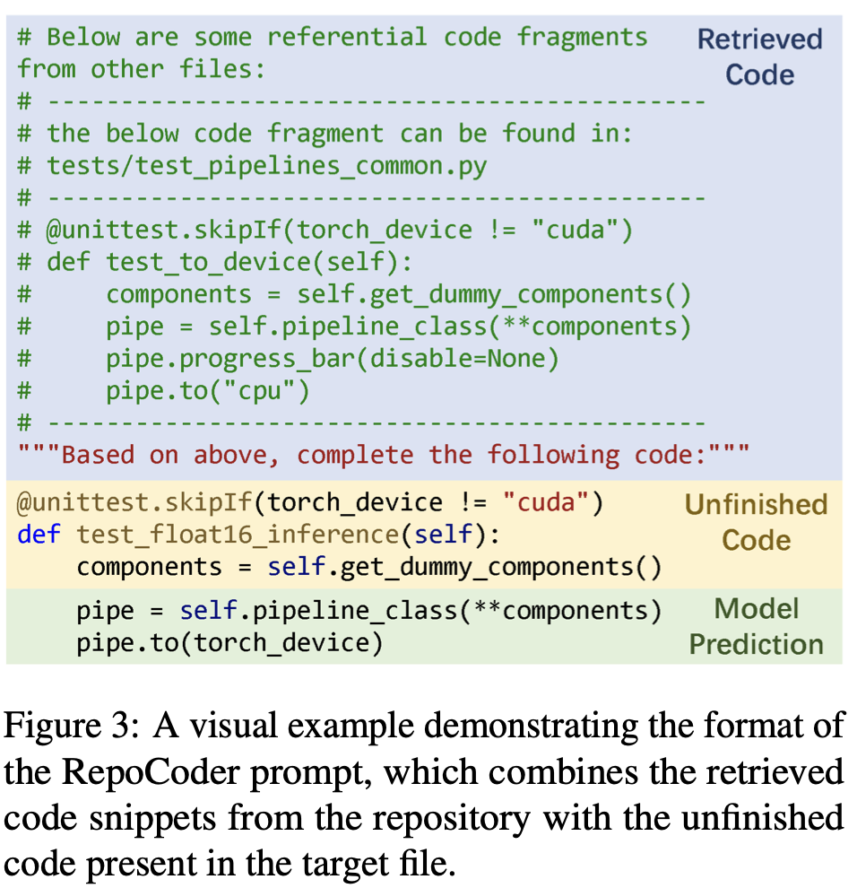

### Dimensions


When we write code, we usually consider the following contexts:
- In-file references
- In-repo references that cross multiple files
- Code execution results guides us to update code iteratively
- Github Issues / PRs / Discussions express requirements & other infos

In the figure, I list out some benchmarks specifically designed to test out different aspects of code LM's performance. Context scope is the biggest differentiator among them. There are many more benchmarks that differentiate from these benchmarks taking into account of other concerns, e.g. HumanEval only contains 164 python problems, they can be extended[^bigcodeharness] to more languages HumanEvalPack, more unit tests per problem HumanEval+ (similarly MBPP+), DS-1000[^DS-1000] benchmarks completion of API calls of data science libraries.

In general, when talking about a code LM's benchmark, here are the factors and questions that usually needs to be considered:

- Benchmark setting
	- context scope: in function -> in class -> in file -> in repo -> end to end
	- prompt format[^safim] :
		- code completion: Left-to-Right(L2R)
		- code infilling or Fill-in-the-Middle (FIM): Prefix-Suffix-Middle(PSM), Suffix-Prefix-Middle(SPM), Instructed-Prefix-Feeding(IPF)
		- zero shot or few shots
- Dataset curation
	- data leakage: standard practices to argue for no data leakage are
		- use repos that is created after model's training data cutoff date
		- use repos with no fork
		- manually generate dataset problem like HumanEval
		- continually updated
	- data filtering & deduplication: very often a dataset is built on top of another larger but more raw dataset, the filtering factors can be:
		- repo stats: language, stars
		- if has test cases
		- number of source code files
		- if has documentations
		- parse / static analysis (linter) result[^treesitter] [^pyan], usually to locate code snippets that requires cross-file context
		- depending on benchmark setting, conditions composed of the above factors will be used to apply the filtering
- Metrics
	- execution @k pass rate if there are unit tests
	- similarity based metrics if no unit tests
		- exact match (EM), edit similarity (ES)
		- @k accuracy, recall

### Terms

- The Stack Dataset[^thestack] : 3TB source code files covering 30 programming languages (PLs), StarCoder model is trained on this dataset. Many benchmark datasets try to avoid overlap with it.
- Jaccard similarity: $$ J(A, B) = \frac{|A\cap B|}{|A\cup B|}$$ where A and B are set of items. Unlike BM25, it does not care about term frequency, only its presence or absence.
- BM25[^bm25] or best match 25: some paper call it sparse / lexical retrieval[^reacc] , it is based on implementation of ElasticSearch, its algorithm is an extension of TF-IDF. As a term-based retrieval method, it considers each code fragment as a code token sequence and employs bag-of-words representations. The matching score computed by BM25 indicts lexical similarity between the query and document.
- Exact Match: 1 if predicted code exactly match the ground truth code, and 0 otherwise.
- Edit Similarity: edit distance counts the minimum number of operations required to transform one string into the other, the most common measure is Levenshtein distance, which counts the minimum number of single-character edits (insertion, deletion or substitution) required. ES is defined as $$ ES = 1 - \frac{Lev(\hat{Y},Y)}{max(|\hat{Y}|,|Y|)} $$ where $|Y|$ refers to length of the string.
- UniXcoder[^unixcoder] & CodeBERT: some paper categories them as semantic[^repobench] / dense[^repocoder] retrievers, they are just embedding models for code snippets retrieval.
- Tree-sitter[^treesitter] : Tree-sitter generates parsers that produce a concrete syntax tree (CST) from source code, which is crucial for performing static analysis and developing linters. These parsers support incremental updates, enhancing efficiency in tools requiring real-time feedback, such as text editors. Linters use the CST, often simplified to an abstract syntax tree (AST), for detecting code irregularities and enforcing style guidelines. Both linters and broader static analysis tools benefit from Tree-sitter's precise, incrementally updated parsing to efficiently analyze code, detect errors, and ensure consistency.

### Benchmarks

#### HumenEval[^humanevalpaper] [^humanevalrepo]

- 164 hand written python programming problems, each problem includes a function signature, docstring, body (ground truth solution, not used for execution based metric), and several unit tests (avg 7.7 tests per problem).
- Prompt (0 shot)
	- instruction
		```text
		Read the following function signature and docstring, and fully implement the function described. Your response should only contain the code for this function.
		```
	- function signature + docstring
		```python
		from typing import List


		def has_close_elements(numbers: List[float], threshold: float) -> bool:
		    """ Check if in given list of numbers, are any two numbers closer to each other than
		    given threshold.
		    >>> has_close_elements([1.0, 2.0, 3.0], 0.5)
		    False
		    >>> has_close_elements([1.0, 2.8, 3.0, 4.0, 5.0, 2.0], 0.3)
		    True
		    """
		```

- Metric pass@k
	- method 1: directly generate k code samples per problem, a problem is solved if any sample passes all unit tests. when the number of problems is small, computing pass@k in this way can have high variance.
	- method 2: generate $n \ge k$ code samples ($n=200, k\le100$), count the number of correct samples $c \le n$ which pass all unit tests, then pass@k is defined as $$ pass@k := \mathop{\mathbb{E}}_{Problems}\left[1 - \frac{n-c \choose k}{n \choose k}\right] $$
	- 0 shot pass@1 rate for gpt4, claude and llama range between 62 to 91 depending on model size, see full list [^simpleeval]

#### MBPP[^mbpp]
- MBPP is short for mostly basic programming problems
- 974 short programs (task id 1-974) manually constructed by crowdworkers with basic knowledge of python
- task id 1-10 were used for few-shot prompting during testing, usually use task id 2,3,4 for 3 shot prompts. task id 11-510 are used for testing. (task ids 511-600 and 601 - 974 are val / train splits which are usually not used)
- Prompt (3 shots)
	```text
	You are an expert Python programmer, and here is your task: Write a function to find the similar elements from the given two tuple lists. Your code should pass these tests:

	assert similar_elements((3, 4, 5, 6),(5, 7, 4, 10)) == (4, 5)
	assert similar_elements((1, 2, 3, 4),(5, 4, 3, 7)) == (3, 4)
	assert similar_elements((11, 12, 14, 13),(17, 15, 14, 13)) == (13, 14)
	[BEGIN]
	def similar_elements(test_tup1, test_tup2):
	  res = tuple(set(test_tup1) & set(test_tup2))
	  return (res)
	[DONE]
	You are an expert Python programmer, and here is your task: Write a python function to identify non-prime numbers. Your code should pass these tests:

	assert is_not_prime(2) == False
	assert is_not_prime(10) == True
	assert is_not_prime(35) == True
	[BEGIN]
	import math
	def is_not_prime(n):
	    result = False
	    for i in range(2,int(math.sqrt(n)) + 1):
	        if n % i == 0:
	            result = True
	    return result
	[DONE]
	You are an expert Python programmer, and here is your task: Write a function to find the largest integers from a given list of numbers using heap queue algorithm. Your code should pass these tests:

	assert heap_queue_largest( [25, 35, 22, 85, 14, 65, 75, 22, 58],3)==[85, 75, 65]
	assert heap_queue_largest( [25, 35, 22, 85, 14, 65, 75, 22, 58],2)==[85, 75]
	assert heap_queue_largest( [25, 35, 22, 85, 14, 65, 75, 22, 58],5)==[85, 75, 65, 58, 35]
	[BEGIN]
	import heapq as hq
	def heap_queue_largest(nums,n):
	  largest_nums = hq.nlargest(n, nums)
	  return largest_nums
	[DONE]
	You are an expert Python programmer, and here is your task: Write a python function to remove first and last occurrence of a given character from the string. Your code should pass these tests:

	assert remove_Occ("hello","l") == "heo"
	assert remove_Occ("abcda","a") == "bcd"
	assert remove_Occ("PHP","P") == "H"
	[BEGIN]
	```

- Metrics:
	- usually use 3 shot pass@1 rate, using similar method as HumanEval setting $k=1$, but different benchmark implementations have different $n$ value. Difficult to find a consistent evaluation between different implementations/papers/leaderboards due to
		- use greedy decoding (setting T=0) or not
		- use sanitized subset or not
		- use prompt as doc string or not
		- different n values
	- In general current sota models achieves 85%-90% pass@1 rate. Here is a list of leaderboards for reference (EvalPlus is more authentic in my opinion)
		- EvalPlus leaderboard [^evalplus]
		- paperwithcode provide a ranked list for MBPP and HumanEval[^paperwithcode]

#### RepoCoder[^repocoder]
- a repo wise code completion problem can be abstracted as $$\begin{align} C_{ret} &= R(C_{repo}, X) \\ \hat{Y} &= M(C_{ret}, X)\end{align}$$ where $X$ is the unfinished code, and $C_{repo} = \{c_1, c_2, \cdots\}$ is the repo, $c_i$ is the code snippet, $R$ is the retrieval function, $C_{ret}$ is the retrieved code snippets, $M$ is the code generation model
- introduce an iterative retrieval-generation framework for repo level code completion.
  
  $$\begin{align}C_{ret}^{i} &= R(C_{repo}, X, \hat{Y}^{i-1}) \\ \hat{Y}^{i-1} &= M(C_{ret}^{i-1}, X)\end{align}$$
  more specifically, in $i$-th iteration of retrieval, use the last $S_w - S_s$ lines of $X$ and first $S_s$ lines of $\hat{Y}^{i-1}$ as the query to retrieve $C_{ret}^{i}$.
- construct $C_{repo}$: use sliding window with window size $S_w$ lines of code, the sliding window moves with step size $S_s$ lines of code
- prompt example
  
- curate RepoEval dataset:
	- python repos from github, after Jan 1, 2022, non-fork original repos, over 100 stars, over 80% of files in python, explicit unit tests
	- from above, curate 3 specific sub dataset for different purpose
		- line completion: randomly select 200 lines from 8 repos to complete. 1600 test samples
		- api invocation completion: from the same 8 repos as above, randomly select 200 non-repetitive api invocations per repo. 1600 test samples
		- function body completion: randomly select a separate set of smaller scale repos, location functions covered by unit tests, select function bodies containing 3 to 30 loc. 373 test samples.
- Metrics
	- for line completion and api invocation completion, use EM and ES. Oracle method utilizes the last $S_w - S_s$ lines of $X$ and the first $S_s$ lines of the ground truth code $Y$ to retrieve code snippets $C_{ret}^{gt}$, and then use it for completion.
	  
	- for function body completion, use pass rate.
	  
- Conclusions / insights
	- the most helpful code snippets typically contain code statements similar to the target completion or demonstrate example usages of the target API invocation
	- utilizing the model’s predictions as supplementary context to inform the retrieval process is helpful

#### CrossCodeEval[^crosscodeeval]
- dataset curation
	- repos created between 2023-03-05 and 2023-06-15
	- four languages: python, java, typescript, c#
	- repo zipped size < 1MB & stars >= 3 & 10 <= number of code files <= 50
	- dedup from the Stack dataset[^thestack]
	- use replace & static analysis to find the position to construct (prompt, reference/completion) + extra complicated filtering
	  
	- ended up with 471, 239, 193 and 99 repos for each language, ~10k examples
	  

- Metrics: no unit tests, so use similarity metrics EM and ES
- Retrieval:
	- embedding: non-overlapping sliding window of 10 lines code fragments
	- query: last 10 lines of in-file context
	- search algorithm: BM25, return top 5 code snippets
	  
- Observations
	- performance improves with better cross-file context (In-file → Retrieval → Retrieval w/ Ref.)
	- the variation of correct/incorrect generation is significant when changing from Retrieval to Retrieval w/ Ref
	- OpenAI’s ada embedding is generally better than both BM25 and UniXCoder

#### RepoBench[^repobench]
- data curation
	- training set (optional):
		- curated from github-code dataset[^githubcode] with cutoff date Mar 16, 2022
		- 32 < number of files < 128
		- filter out 10345 python repos + 14956 java repos
	- test set
		- scraped python and java repos created after Feb 9, 2023 and before Aug 3, 2023
		- 1075 python repos + 594 java repos
- experiment observations:
	- for retrieval, UniXcoder > Jaccard Similarity > Edit Similarity, this suggests that the shared tokens between code fragments play a more important role than their precise arrangement in enhancing the retrieval performance.
	- python retrieval show higher accuracy than java, might be attributed to Python’s simpler syntax and less verbose nature, potentially reducing the variability of similar code snippets. Additionally, the common Python practice of defining function arguments in close proximity to their corresponding function calls could provide valuable context that aids retrieval.
	- after retrieval, positioning higher similar code snippets adjacent to or in close proximity to the line requiring completion tends to improve code completion performance.

#### EvoCodeBench[^evocodebench]
- dataset curation
	- standalone vs non-standalone
	  
	- to be a good benchmark: How EvoCodeBench was curated
		- real world repos: collected from github repos
		- real code distribution (standalone / non-standalone): distribution are consistent with 500 real-world repos
		- comprehensive annotations (natural language requirements, ground truths including code and dependencies): offers comprehensive annotations, requirements are autogenerated by LMs
		  
		- robust eval metrics (contain test cases): has test cases
		- avoid data leakage: EvoCodeBench-2403 consists of 275 samples from 25 repos, is an evolving benchmark updated every period
- metrics
	- pass@k: same as HumanEval
	- recall@k: $$Recall@k := \mathop{\mathbb{E}}_{problems}\left[\mathop{max}_{i\in[1, k]}\frac{|\mathbb{R}\cap\mathbb{P}_i|}{|\mathbb{R}|}\right]$$ where $\mathbb{R}$ is the reference dependencies, $\mathbb{P}_i$ is the parsed dependencies for $i$-th generation, and for each problem generate $k$ times.
	- though dataset has good annotations with cross-file context, the experiment is focused only on in-file completion / infilling. prompt templates for each task for instructing tuned model or standard language model are given in Appendix B.2
- observations are trivial, context helps, gpt4 is the best

#### CodeAgent[^codeagent]
- dataset curation
	- 5 python repo, total 101 functions, with rich documentation and contextual dependencies,  with test suites
	  
	  an example
	  
- Usage of agents
	- 5 tools: leverages BM25 as documentation reading tool, black as format checker tool, symbol search will return all defined symbols in a given file path or the implementation code of given symbol name
	  
	- 4 agent strategies: ReAct, Tool-Planning, OpenAI function calling, rule-based tool usage(simulate programmers website search -> documentation reading -> symbol navigation -> format checker -> execution feedback, cycle limits at 3)
- observations
	- CodeAgent is better than NoAgent,
	- strategy performance: Rule-based (GPT4 pass@1 37.6%) > ReAct > OAI function call > Tool-Planning

#### SWE-Bench[^swebench]
- problem setting is starting from an issue, generate a patch that is evaluated against real tests. Formally, given an issue text description and a complete codebase, the model is then tasked to make an edit to the codebase to resolve the issue, which in practice is represented as patch files, specifying which lines in the codebase to modify.
  
- dataset curation
	- ~90000 PRs from 12 popular repos
	- PR filtering: 1. resolve an issue, 2. make changes to the test files, 3. pass all tests with at least one fail-to-pass test, 4. no installation or runtime error. After filtering, 2294 PRs (or task instances in the paper) left which comprise SWE-bench.
- prompt
  
  
- Metrics: percentage of task instances that are resolved.
	- sparse retrieval using BM25, retrieve as many files as fits within the maximum context limits
	- oracle retrieval uses the edited files of the ground truth patch
- Observations (that I found interesting)
	- longer context can retrieve more oracle files but resolve rates decrease, as models see a lot of code that may not be directly related to solving the issue at hand, and they seem to frequently struggle with localizing problematic code needing to be updated.
	  
	- generating patches is easier than generating whole files.
	- language models tend to generate short, simple edits, rarely edit more than a single file.

#### SWE-Agent[^sweagent]
- interface between agent and computer
	- agent: program, interface: api
	- agent: human, interface: UI
	- agent: LM, interface: ACI (agent computer interface)
	  
- ACI specifies the commands available to the LM and how the environment state after the execution of each command will be communicated back to the LM. It also tracks the history of all previous commands and observations, and at each step, manages how these should be formatted and combined with high-level instructions into a single input for the language model.
  
- why ACI? HCI interfaces like VSCode Vim have rich visual components and feedback that make them powerful tools for humans, but may not be as suited to LMs. The interactions and output from HCI interfaces can be verbose, granular, and inefficient. We humans are good at ignoring unexpected inputs, but LMs are sensitive and can get distracted and confused easily. This paper shows LMs are substantially more effective when using interfaces built with their needs and limitations in mind.
- Agent needs a simplified interface to the computer. A well-designed ACI should
	- help the agent understand the state of the repository given the previous changes
	- help the agent recover from mistakes
	- remove unnecessary context from prior observations
	- suppress any unusual, lengthy program outputs
- Built on top of the common Linux commands and utilities, ACI implements specific search/navigation, file viewer, file editor and context management.
  
- Agent behaviors:
	- usually starts a problem by attempting to write reproduction code (create - edit - python) and / or localizing the issues's cause to specific code (search_dir / search_file / find_file).
	- majority of turns/iterations are spent editing, after turn 5 most frequently two actions are edit and python.
	- agents succeed fast and fail slowly, they rarely recognize dead ends or reset their problem solving approach.
- SWE-agent w/ GPT-4 Turbo resolve rate: 12.47% for SWE-bench, 18% for SWE-bench lite.

#### DeepSeek-Coder[^deepseekcoder]
- training data curation
  
	- data crawling & rule filter: before Feb 2023, 87 programming lanugages, apply similar filtering rule to StarCoder project, left with 32.8% of its original size.
	- dependency parsing: topological sort for dependency graph, the algorithm returns a list of sorted sequences, and each sequence’s files are concatenated to form a single training sample, a comment indicating the file’s path is added at the beginning of each file.
	- repo-level deduplication: treat the concatenated code from the repository level as a single sample and apply the same near-deduplication algorithm to ensure the integrity of the repository structure, previous methods mostly use file-level deduplication.
	- quality screening: employ a compiler and a quality model, combined with heuristic rules, to further filter out low-quality data, left with 798GB with 603 million files. Use n-gram filtering to filter out files containing docstrings, questions, and solutions from sources such as HumanEval, MBPP, GSM8K and MATH.
- training strategy
	- not token prediction / code completion
	- FIM (fill in the middle): PSM (prefix-suffix-middle), SPM (suffix-prefix-middle)
	  observation: the model demonstrates peak performance on the HumanEval-FIM with a 100% FIM rate, this configuration also results in the weakest code completion capability. To achieve a balance between FIM efficiency and code completion proficiency, the paper ultimately choose the 50% PSM rate as the preferred training policy.
	- training example:
	  <｜fim_start｜>$f_{pre}$<｜fim_hole｜>$f_{suf}$<｜fim_end｜>$f_{middle}$<|eos_token|>
- tokenizer: bpe training, 32,000 vocab size
- techniques used: RoPE (rotary position embedding), GQA (grouped query attention), FlashAttention v2, context window: 16384 tokens.
- instruction tuning: high-quality data in Alpaca Instruction format
- Evaluations
	- code completion: ExpandedHumanEval (8 programming languages), MBPP, DS-1000, LeetCode contest.
	- FIM code completion: benchmarked on a single-line infilling benchmarks including 3 different programming languages.
	- cross-file code completion: benchmarked on CrossCodeEval dataset, used BM25 search results provided in CrossCodeEval paper for cross-file context.
		- maximum sequence length: 2048 tokens
		- maximum output length: 50 tokens
		- maximum cross-file context: 512 tokens
- continued pre-training from base model using extra 2 trillion tokens with solely next token prediction objective with 4K context length, resulting v1.5, experiments show slight decrease in coding performance, but marked improvements in Math Reasoning and Natural Language.

### Takeaways
- current benchmarks are messy and not reflecting real development experiences, take conclusions of papers with a grain of salt.
- code search / retrieval result as context has a huge impact on generation quality, can be improved possibly by
	- taking into account of AST / static analysis result during embedding and searching.
	- retrieving codes in an agentic manner through multi turns.
- solving coding problems end to end requires agents that incorporate all possible system commands and execution feedbacks.
- open sourced coding models that deserves attention: DeepSeek-Coder, CodeQwen1.5

[^humanevalpaper]: [paper: Evaluating Large Language Models Trained on Code](https://arxiv.org/pdf/2107.03374)

[^humanevalrepo]: [repo: openai/human-eval](https://github.com/openai/human-eval) | [repo: deepseek-ai/DeepSeek-Coder](https://github.com/deepseek-ai/DeepSeek-Coder/blob/main/Evaluation/HumanEval/humaneval.py)

[^simpleeval]: [repo: openai/simple-eval](https://github.com/openai/simple-evals/blob/main/humaneval_eval.py)

[^mbpp]: [paper: Program Synthesis with Large Language Models](https://arxiv.org/pdf/2108.07732v1) | [repo: google-research/mbpp](https://github.com/google-research/google-research/blob/master/mbpp/README.md)

[^repocoder]: [paper: RepoCoder: Repository-Level Code Completion Through Iterative Retrieval and Generation](https://arxiv.org/pdf/2303.12570) | [repo: microsoft/CodeT/RepoCoder](https://github.com/microsoft/CodeT/tree/main/RepoCoder)

[^crosscodeeval]: [paper: CROSSCODEEVAL: A Diverse and Multilingual Benchmark for Cross-File Code Completion](https://arxiv.org/pdf/2310.11248) | [repo: amazon-science/cceval](https://github.com/amazon-science/cceval) | [project page: CrossCodeEval](https://crosscodeeval.github.io)

[^deepseekcoder]: [paper: DeepSeek-Coder: When the Large Language Model Meets Programming - The Rise of Code Intelligence](https://arxiv.org/pdf/2401.14196) | [repo: deepseek-ai/DeepSeek-Coder](https://github.com/deepseek-ai/DeepSeek-Coder)

[^bigcodeharness]: [repo: bigcode-project/bigcode-evalutaion-harness](https://github.com/bigcode-project/bigcode-evaluation-harness/blob/main/docs/README.md)

[^DS-1000]: [project page: DS-1000](https://ds1000-code-gen.github.io)

[^treesitter]: [Tree-Sitter](https://tree-sitter.github.io/tree-sitter/)

[^pyan]: [repo: davidfraser/pyan](https://github.com/davidfraser/pyan)

[^safim]: [paper: Evaluation of LLMs on Syntax-Aware Code Fill-in-the-Middle Tasks](https://arxiv.org/pdf/2403.04814)

[^thestack]: [dataset: the-stack](https://huggingface.co/datasets/bigcode/the-stack)

[^unixcoder]: [paper: UniXcoder: Unified Cross-Modal Pre-training for Code Representation](https://arxiv.org/pdf/2203.03850)

[^repobench]: [paper: RepoBench: Benchmarking Repository-Level Code Auto-Completion Systems](https://arxiv.org/pdf/2306.03091)

[^evocodebench]: [paper: EvoCodeBench: An Evolving Code Generation Benchmark Aligned with Real-World Code Repositories](https://arxiv.org/pdf/2404.00599)

[^codeagent]: [paper: CODEAGENT: Enhancing Code Generation with Tool-Integrated Agent Systems for Real-World Repo-level Coding Challenges](https://arxiv.org/pdf/2401.07339)

[^bm25]: [paper: The Probabilistic Relevance Framework: BM25 and Beyond](https://dl.acm.org/doi/10.1561/1500000019)

[^reacc]: [paper: ReACC: A Retrieval-Augmented Code Completion Framework](https://arxiv.org/pdf/2203.07722)

[^swebench]: [paper: SWE-BENCH: CAN LANGUAGE MODELS RESOLVE REAL-WORLD GITHUB ISSUES?](https://arxiv.org/pdf/2310.06770)

[^sweagent]: [paper: SWE-AGENT: AGENT-COMPUTER INTERFACES ENABLE AUTOMATED SOFTWARE ENGINEERING](https://swe-agent.com/paper.pdf)

[^paperwithcode]: [paperwithcode humaneval leaderboard](https://paperswithcode.com/sota/code-generation-on-humaneval) | [paperwithcode mbpp leaderboard](https://paperswithcode.com/sota/code-generation-on-mbpp)

[^evalplus]: [EvalPlus leaderboard](https://evalplus.github.io/leaderboard.html) | [repo: evalplus/evalplus](https://github.com/evalplus/evalplus)

[^githubcode]: [dataset: github-code](https://huggingface.co/datasets/codeparrot/github-code)

[^sampling]: [article: How to generate text](https://huggingface.co/blog/how-to-generate)
